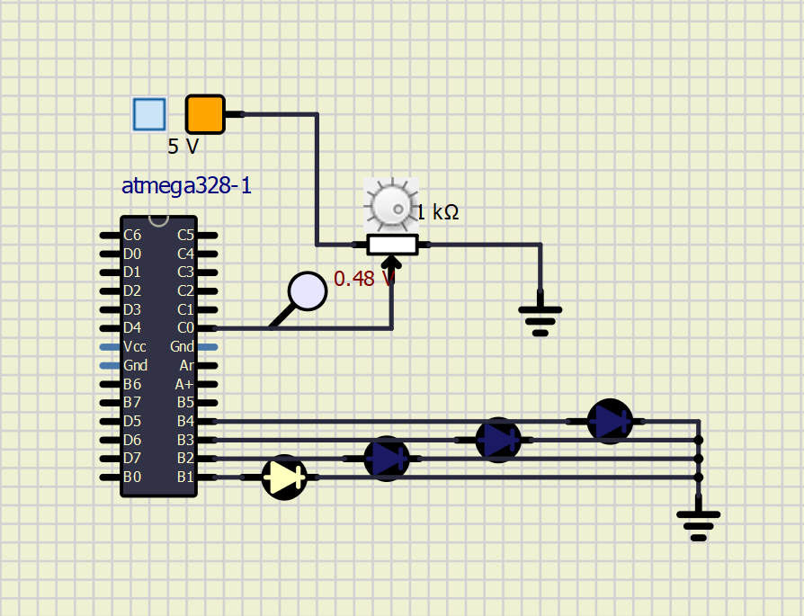
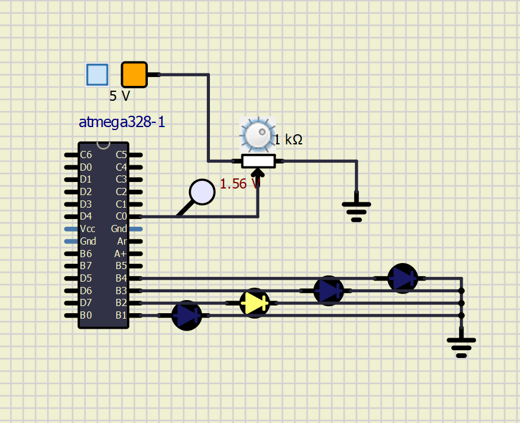
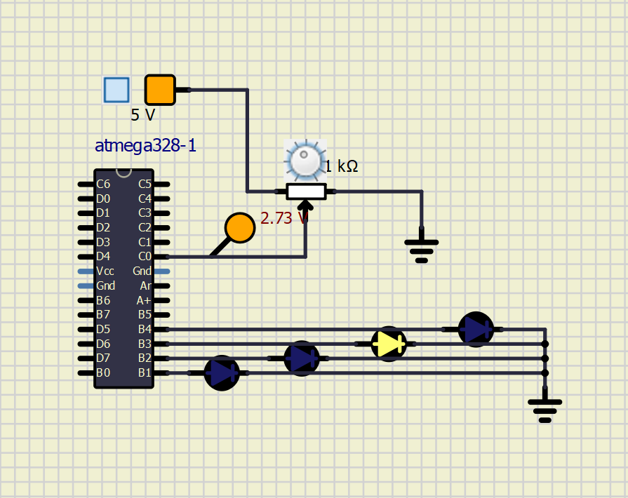

# AIM: 
## To take input from temperature sensor and to indicate changes at a particular temperature

Since temp sensor is not availaible in simul ide made use of potentiometer and calculated the voltages for 
particuar range

## The table

|Voltage(V)|Analog range|LED status|
|--- |--- |--- |
|0.0-1.0|0-200|B1 LED on|
|1.2-2.4|210-500|B2 LED on|
|2.5-3.6|510-700|B3 LED on|
|3.8-5.0|710-1024|B4 LED on|

## SIMULATION  RESULT

