

# SEAT HEATING MECHANISM
1. The user enters the car and occupies the seat, one switch gets activated.
2. He/She turns on the heat sensor(which acts as second switch).
3. If both of the above condition are met, then the LED will turn ON and the temperature sensor keeps monitoring and recording the temperature value to ATmega328.
4. ATmega328 will convert the input analog value and will give the output of temperature value using UART( Serial communication).
5. The temperature value will be diplayed on the screen.

# SIMULATION RESULTS
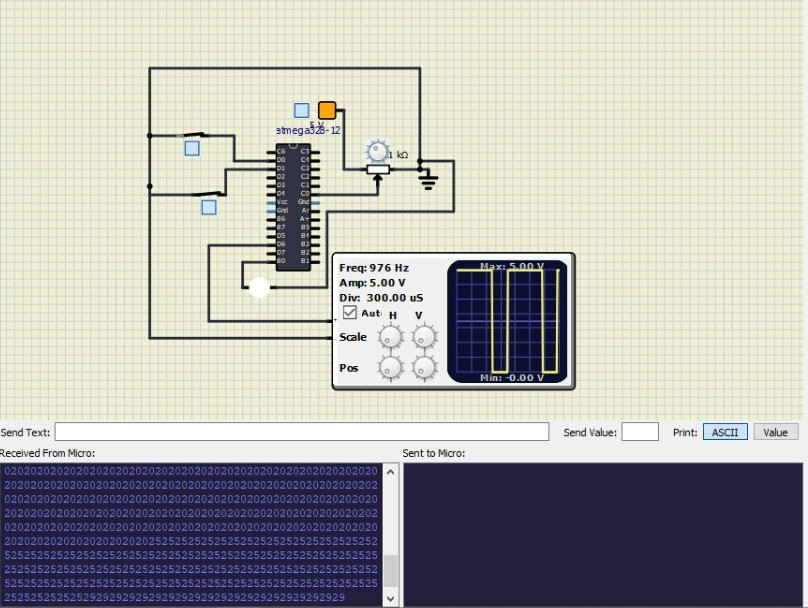

## Activity 1

If the user seated on the seat, he has to turn on the heat button, only then the LED should turn ON.

| Logic State | LED Status |
| ----- | ----- |
| 0 0 | OFF |
| 0 1 | OFF |
| 1 0 | OFF |
| 1 1 | ON |

### Simulation Results
|Both Switches are open|Either one of switches is open|Either one of switches is open|Both the switches are closed|
|----|----|----|----|
|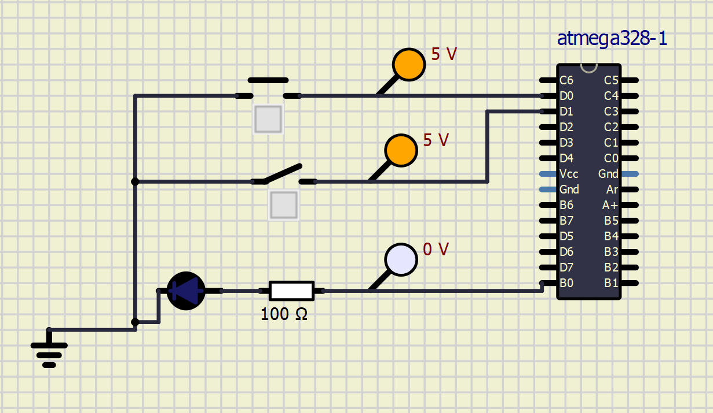|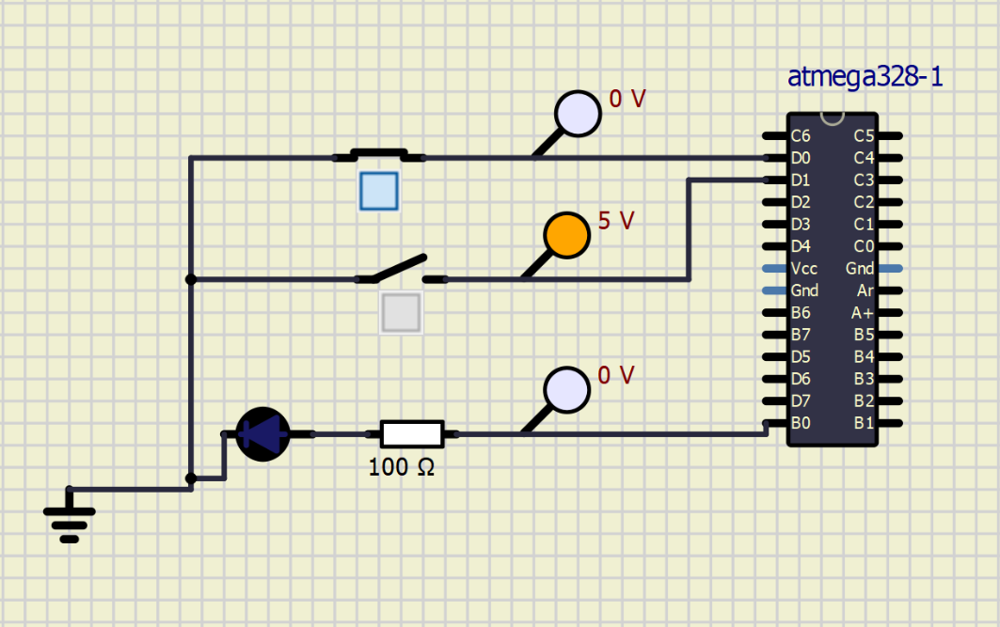|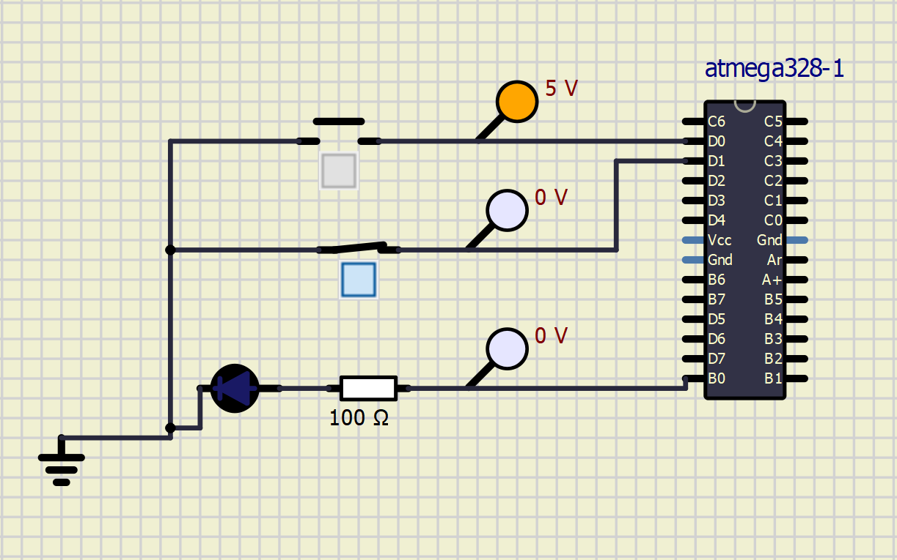|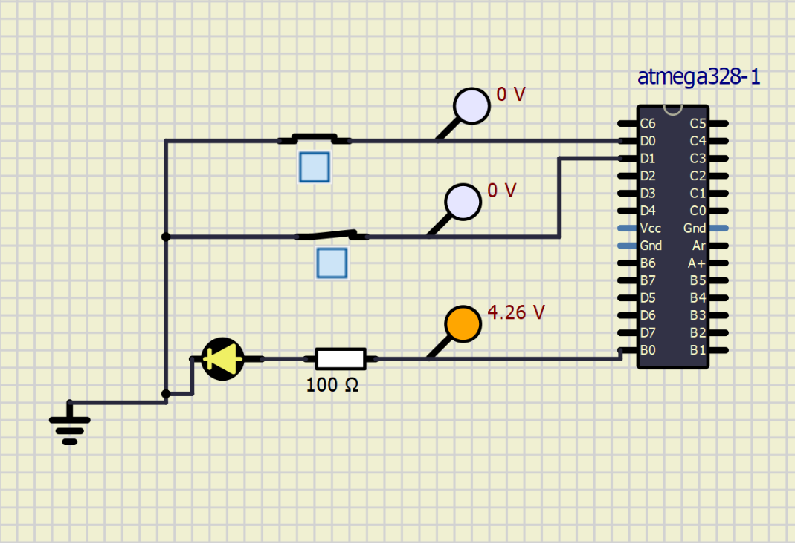|

## Activity 2

**To take input from temperature sensor and to indicate changes at a particular temparture.**

Since temperature sensor is not availaible in simul ide, potentiometer is used and the voltages are calculated for particular range.

|Voltage(V)|0.0-1.0|1.2-2.4|2.5-3.6|3.8-5.0|
|----|----|----|----|----|
|**Analog Value**|0-200|210-500|510-700|710-1024|
|**Status**|B1 LED ON|B2 LED ON|B3 LED ON|B4 LED ON|
|**Simuation Results**|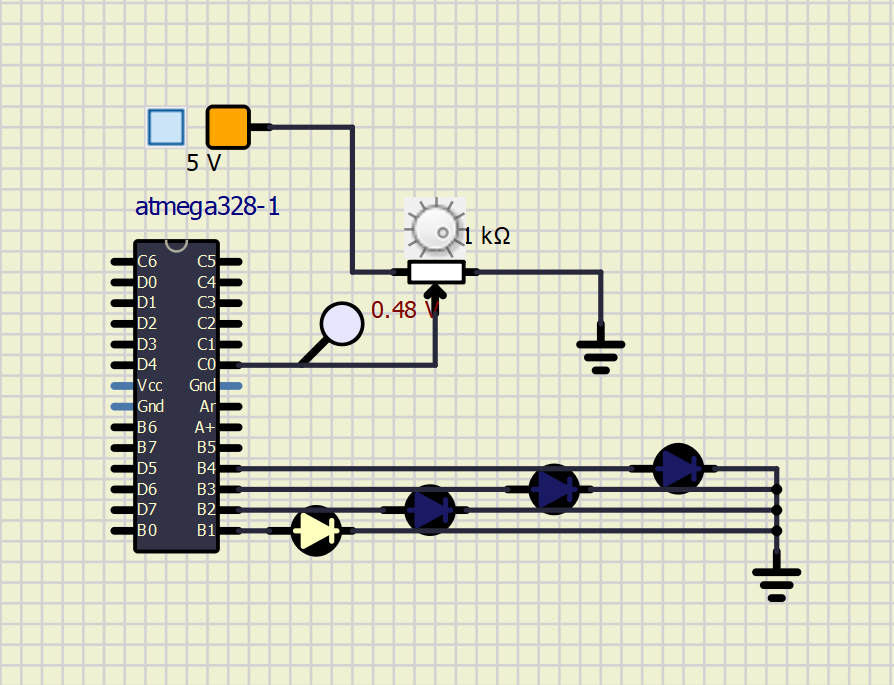|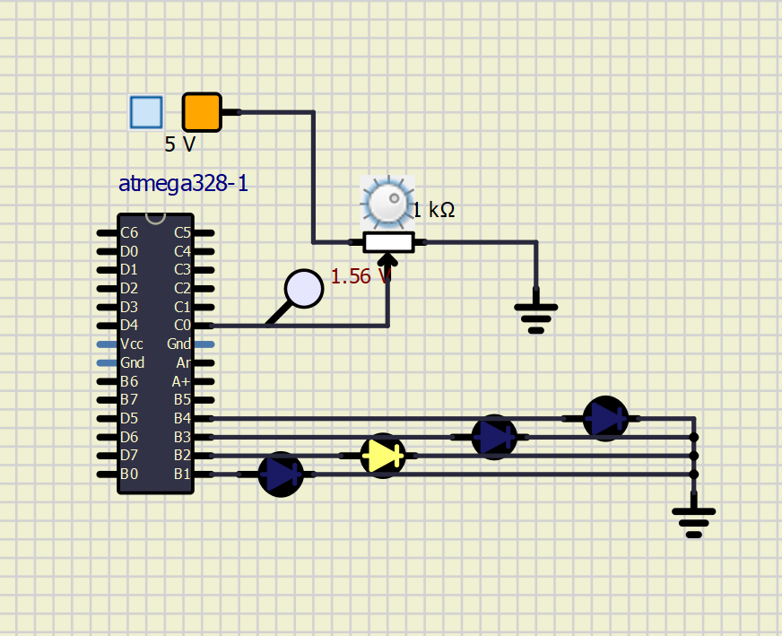|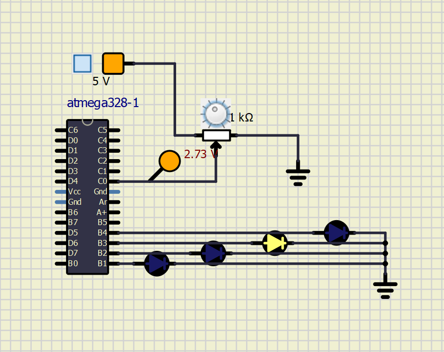|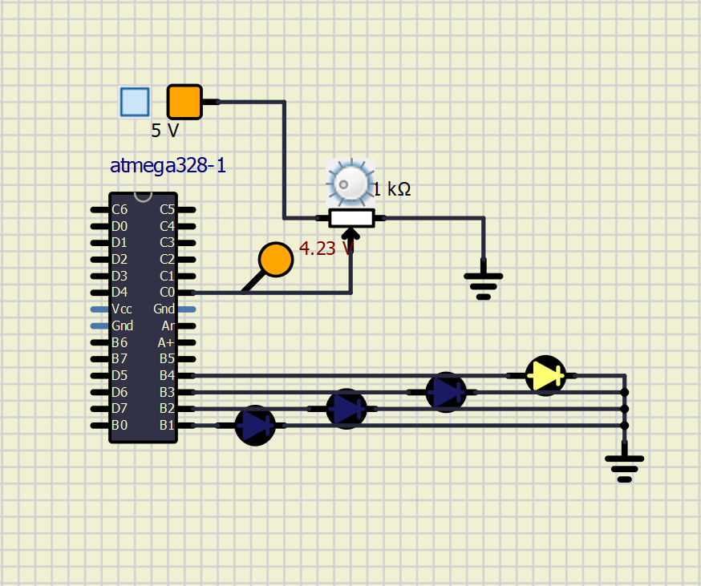|

## Activity 3

**To generate PWM at different analog values**

|ADC Value(Temp Sensor)|Output PWM|
|----|----|
|0-200|20%|
|210-500|40%|
|510-700|70%|
|710-1024|95%|

### Simulation Results

|Output PWM 20%|Output PWM 40%|Output PWM 71%|Output PWM 95%|
|----|----|----|----|
|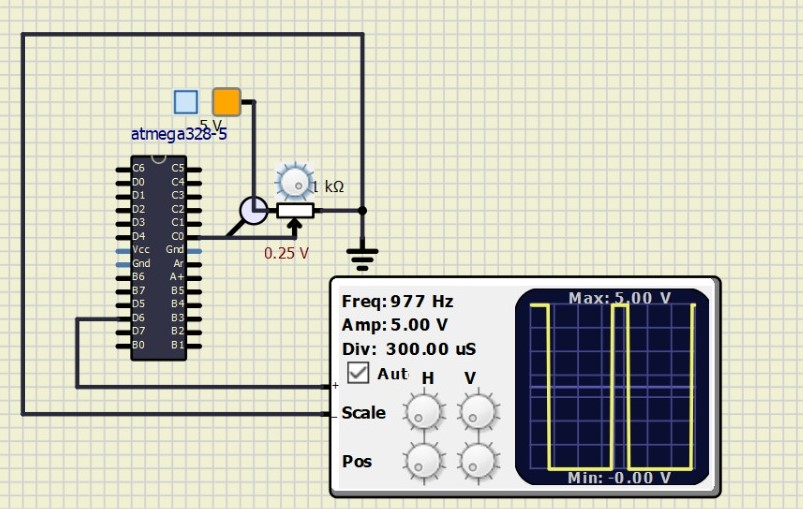|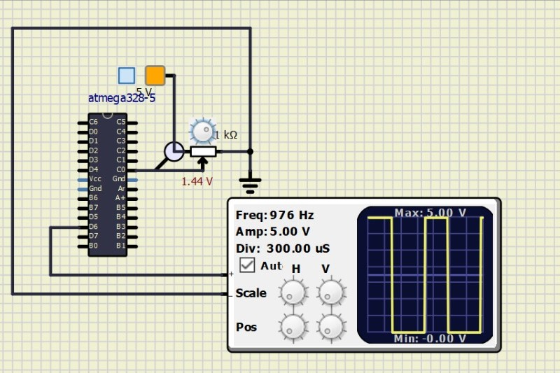|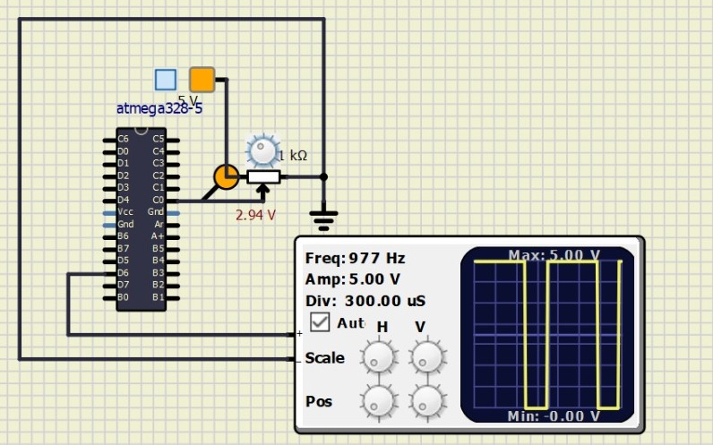|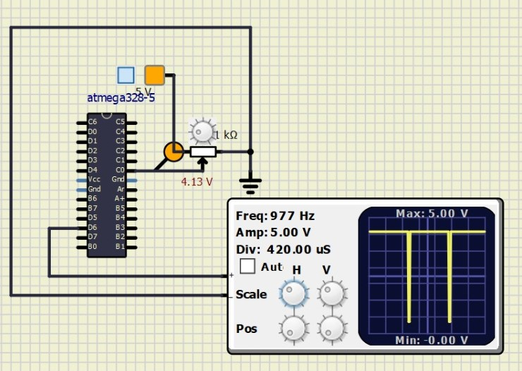|

## Activity 4

**To send the temperature value to Serial monitor**

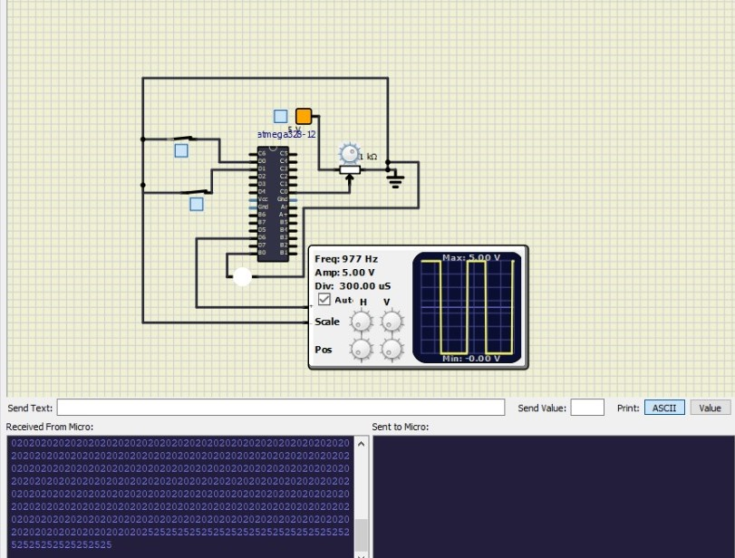